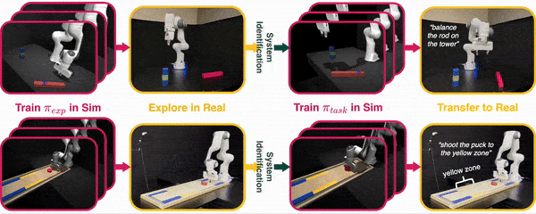
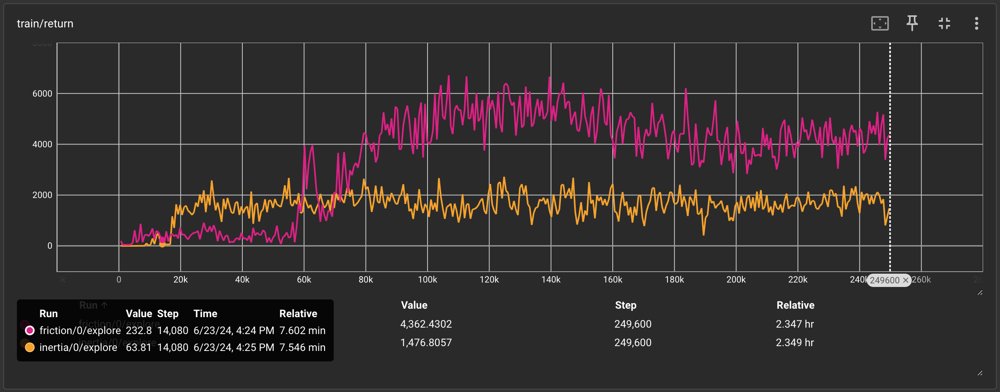
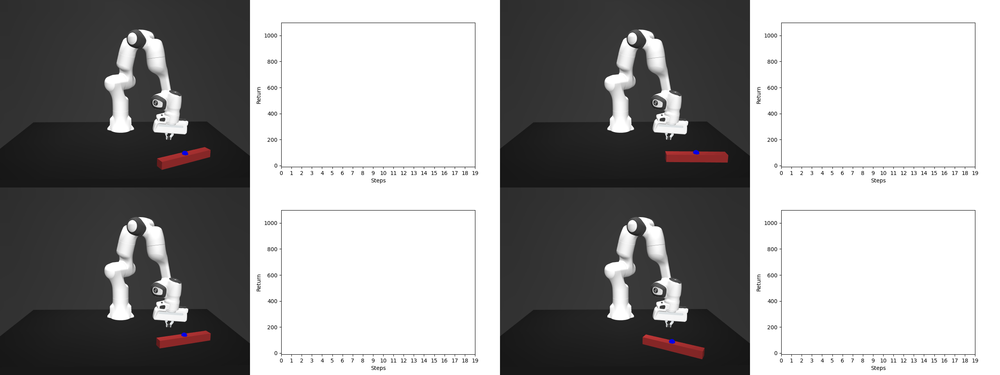

<p align="center">
  
</p>
<h1 align="center">Active Exploration for System Identification in Robotic Manipulation</h1>

<p align="center"> <a href='https://memmelma.github.io'>Marius Memmel</a>, <a href='https://homes.cs.washington.edu/~ajwagen/index.html'>Andrew Wagenmaker</a>, <a href='https://homes.cs.washington.edu/~zchuning/'>Chuning Zhu</a>, <a href='https://patrickyin.me/'>Patrick Yin</a>, <a href='https://homes.cs.washington.edu/~fox/'>Dieter Fox</a>, <a href='https://abhishekunique.github.io/'>Abhishek Gupta</a>

</p>

<p align="center">ICLR 2024 (oral)</p>

<p align="center">
  <a href='https://openreview.net/pdf?id=jNR6s6OSBT'>paper</a> |
  <a href='http://arxiv.org/abs/2404.12308'>arxiv</a> |
  <a href='https://weirdlabuw.github.io/asid/'>website</a>

</p>

<p align="center"></p>

<p align="center">
  
</p>
<p align="center">ASID is a generic pipeline for Sim2Real transfer that solves dynamic tasks zero-shot!</p>
<p align="center">This repository contains our implementation of the Fisher Information objective presented in the paper.</p>

## Setup <a name="setup"></a>

1. Create the conda environment from file:
   ```
   conda env create -f environment.yaml
   ```
   We use [mujoco](https://github.com/google-deepmind/mujoco) as our simulator and [stable-baselines3](https://github.com/DLR-RM/stable-baselines3) for policy training.
2. Activate the conda environment:
   ```
   conda activate asid
   ```
3. Login to wandb (optional)

You're all set!

Code tested with Python 3.9 and CUDA versions 11.8 and 12.3.

## Training <a name="training"></a>
To train a policy with the default configuration (inertia parameter), run
```
python train.py
```
We use [hydra](https://hydra.cc/) to manage the configurations. You can find the configuration files in `configs/`.

This repository supports physics parameters ```inertia``` and ```friction``` for the rod. Pass `asid=inertia`, `asid=friction` to `python train.py` to change the parameters.

By default, the action space is 2DoF, i.e., endeffector x,y delta positions. You can change this by passing `robot=sim_3_dof` (xyz) or `robot=sim_6_dof` (xyz,rpy) but training requires more samples and possibly a longer horizon which you can set by `robot.max_path_length=30`.

To speed up training, we spin up multiple environments in parallel for training and evaluation. Set `num_workers=8`, `num_workers_eval=4` according to your system specifications. **Warning:** since we initialize an additional environment per instance for the gradient computation, start with lower numbers and work your way up. We found `num_workers=32`, `num_workers_eval=4` to work best on a machine with 64GB RAM.

## Visualization <a name="visualizations"></a>
The default setup logs visualizations and metrics to tensorboard. Launch tensorboard like:
```
tensorboard --logdir logdir --host 0.0.0.0 --port 6006
```
You can change the output to stdout and Weights & Biases by passing `log=stdout`, `log=wandb` to `python train.py`.

When using Weights & Biases don't forget to log in and pass your username like `log.entity=USERNAME`.

## Example <a name="example"></a>

Here's an example of the training loss (friction, inertia) and policy behavior (friction) after 250k steps with the default parameters:

<p align="center">
  
  
</p>


**Tipp:** In the intertia setting, the policy might learn to push the rod off the table to maximize reward. Pass `env.safety_penalty=1000` to penalize the rod falling off.

<!-- ## Known Issues
Import Error ... /torch/lib/libtorch_cpu.so: undefined symbol: iJIT_NotifyEvent -> wrong cuda version -->

## Citation
```
@article{memmel2024asid,
  title={ASID: Active Exploration for System Identification in Robotic Manipulation},
  author={Memmel, Marius and Wagenmaker, Andrew and Zhu, Chuning and Yin, Patrick and Fox, Dieter and Gupta, Abhishek},
  journal={arXiv preprint arXiv:2404.12308},
  year={2024}
}
```
